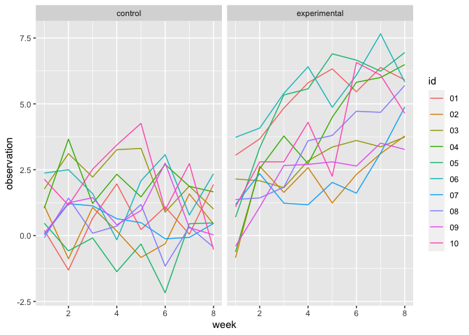

Homework 5
================
Yuan Meng
2021-11-16

``` r
library(tidyverse)
```

    ## ── Attaching packages ─────────────────────────────────────── tidyverse 1.3.1 ──

    ## ✓ ggplot2 3.3.5     ✓ purrr   0.3.4
    ## ✓ tibble  3.1.4     ✓ dplyr   1.0.7
    ## ✓ tidyr   1.1.3     ✓ stringr 1.4.0
    ## ✓ readr   2.0.1     ✓ forcats 0.5.1

    ## ── Conflicts ────────────────────────────────────────── tidyverse_conflicts() ──
    ## x dplyr::filter() masks stats::filter()
    ## x dplyr::lag()    masks stats::lag()

Problem 1

``` r
homicidie_df = 
  read_csv("./data/homicide-data.csv", na = c("", "Unknown")) %>%
  mutate(
    city_state = str_c(city,state),
    resolution = case_when(
      disposition == "Closed without arrest" ~ "unsolved",
      disposition == "Open/No arrest" ~ "unsolved",
      disposition == "Closed by arrest" ~ "solved"
    )) %>%
  relocate(city_state) %>%
  filter(city_state != "TulsaAL")
```

    ## Rows: 52179 Columns: 12

    ## ── Column specification ────────────────────────────────────────────────────────
    ## Delimiter: ","
    ## chr (8): uid, victim_last, victim_first, victim_race, victim_sex, city, stat...
    ## dbl (4): reported_date, victim_age, lat, lon

    ## 
    ## ℹ Use `spec()` to retrieve the full column specification for this data.
    ## ℹ Specify the column types or set `show_col_types = FALSE` to quiet this message.

Baltimore MD

``` r
baltimore_df = 
  homicidie_df %>%
  filter(city_state == "BaltimoreMD")

baltimore_summary = 
  baltimore_df %>%
  summarize(
    unsolved = sum(resolution == "unsolved"),
    n = n()
  )
baltimore_test = 
  prop.test(
  x = baltimore_summary %>% pull(unsolved),
  n = baltimore_summary %>% pull(n))

baltimore_test  %>%
  broom::tidy()
```

    ## # A tibble: 1 × 8
    ##   estimate statistic  p.value parameter conf.low conf.high method    alternative
    ##      <dbl>     <dbl>    <dbl>     <int>    <dbl>     <dbl> <chr>     <chr>      
    ## 1    0.646      239. 6.46e-54         1    0.628     0.663 1-sample… two.sided

``` r
prop_test_function = function(city_df){

  city_summary = 
  city_df %>%
  summarize(
    unsolved = sum(resolution == "unsolved"),
    n = n()
  )
  
  city_test = 
  prop.test(
    x = city_summary %>% pull(unsolved),
    n = city_summary %>% pull(n))
  
  return(city_test)
}


prop_test_function(baltimore_df)
```

    ## 
    ##  1-sample proportions test with continuity correction
    ## 
    ## data:  city_summary %>% pull(unsolved) out of city_summary %>% pull(n), null probability 0.5
    ## X-squared = 239.01, df = 1, p-value < 2.2e-16
    ## alternative hypothesis: true p is not equal to 0.5
    ## 95 percent confidence interval:
    ##  0.6275625 0.6631599
    ## sample estimates:
    ##         p 
    ## 0.6455607

``` r
homicidie_df %>%
  filter(city_state == "AlbuquerqueNM") %>%
  prop_test_function()
```

    ## 
    ##  1-sample proportions test with continuity correction
    ## 
    ## data:  city_summary %>% pull(unsolved) out of city_summary %>% pull(n), null probability 0.5
    ## X-squared = 19.114, df = 1, p-value = 1.232e-05
    ## alternative hypothesis: true p is not equal to 0.5
    ## 95 percent confidence interval:
    ##  0.3372604 0.4375766
    ## sample estimates:
    ##         p 
    ## 0.3862434

``` r
result_df = 
  homicidie_df %>%
  nest(data = uid:resolution) %>%
  mutate(
    test_results = map(data, prop_test_function),
    tidy_results = map(test_results, broom::tidy)
  ) %>%
  select(city_state, tidy_results) %>%
  unnest(tidy_results)

result_df %>%
  mutate(city_state = fct_reorder(city_state, estimate)) %>%
  ggplot(aes(x = city_state, y = estimate)) +
  geom_point() +
  geom_errorbar(aes(ymin = conf.low, ymax = conf.high)) +
  theme(axis.text.x = element_text(angle = 90, vjust = 0.5, hjust = 1))
```

<!-- -->

Problem 2

``` r
study_df = 
  tibble(
    files = list.files("./data/zip_data")) %>%
  mutate(
    files_id = str_remove(files, ".csv"),
    files = str_c("./data/zip_data/", files),
    data = map(files, read_csv)
        ) %>%
    separate(files_id, into = c("treatment_arm", "id"), sep = "_") %>% 
    mutate(
      treatment_arm = case_when(
      treatment_arm == "con" ~"control",
      treatment_arm == "exp" ~ "experimental")) %>%  # divide control and experimental arm
    select(-files) %>%
    relocate(id) %>%
    unnest(data) 

knitr::kable(study_df)
```

| id  | treatment\_arm | week\_1 | week\_2 | week\_3 | week\_4 | week\_5 | week\_6 | week\_7 | week\_8 |
|:----|:---------------|--------:|--------:|--------:|--------:|--------:|--------:|--------:|--------:|
| 01  | control        |    0.20 |   -1.31 |    0.66 |    1.96 |    0.23 |    1.09 |    0.05 |    1.94 |
| 02  | control        |    1.13 |   -0.88 |    1.07 |    0.17 |   -0.83 |   -0.31 |    1.58 |    0.44 |
| 03  | control        |    1.77 |    3.11 |    2.22 |    3.26 |    3.31 |    0.89 |    1.88 |    1.01 |
| 04  | control        |    1.04 |    3.66 |    1.22 |    2.33 |    1.47 |    2.70 |    1.87 |    1.66 |
| 05  | control        |    0.47 |   -0.58 |   -0.09 |   -1.37 |   -0.32 |   -2.17 |    0.45 |    0.48 |
| 06  | control        |    2.37 |    2.50 |    1.59 |   -0.16 |    2.08 |    3.07 |    0.78 |    2.35 |
| 07  | control        |    0.03 |    1.21 |    1.13 |    0.64 |    0.49 |   -0.12 |   -0.07 |    0.46 |
| 08  | control        |   -0.08 |    1.42 |    0.09 |    0.36 |    1.18 |   -1.16 |    0.33 |   -0.44 |
| 09  | control        |    0.08 |    1.24 |    1.44 |    0.41 |    0.95 |    2.75 |    0.30 |    0.03 |
| 10  | control        |    2.14 |    1.15 |    2.52 |    3.44 |    4.26 |    0.97 |    2.73 |   -0.53 |
| 01  | experimental   |    3.05 |    3.67 |    4.84 |    5.80 |    6.33 |    5.46 |    6.38 |    5.91 |
| 02  | experimental   |   -0.84 |    2.63 |    1.64 |    2.58 |    1.24 |    2.32 |    3.11 |    3.78 |
| 03  | experimental   |    2.15 |    2.08 |    1.82 |    2.84 |    3.36 |    3.61 |    3.37 |    3.74 |
| 04  | experimental   |   -0.62 |    2.54 |    3.78 |    2.73 |    4.49 |    5.82 |    6.00 |    6.49 |
| 05  | experimental   |    0.70 |    3.33 |    5.34 |    5.57 |    6.90 |    6.66 |    6.24 |    6.95 |
| 06  | experimental   |    3.73 |    4.08 |    5.40 |    6.41 |    4.87 |    6.09 |    7.66 |    5.83 |
| 07  | experimental   |    1.18 |    2.35 |    1.23 |    1.17 |    2.02 |    1.61 |    3.13 |    4.88 |
| 08  | experimental   |    1.37 |    1.43 |    1.84 |    3.60 |    3.80 |    4.72 |    4.68 |    5.70 |
| 09  | experimental   |   -0.40 |    1.08 |    2.66 |    2.70 |    2.80 |    2.64 |    3.51 |    3.27 |
| 10  | experimental   |    1.09 |    2.80 |    2.80 |    4.30 |    2.25 |    6.57 |    6.09 |    4.64 |

``` r
clean_df = 
  study_df %>%
    pivot_longer(
        week_1:week_8,
        names_to = "week",
        names_prefix = "week_",
        values_to = "observation") %>%
    mutate(
      week = as.numeric(week)
      ) 
clean_df
```

    ## # A tibble: 160 × 4
    ##    id    treatment_arm  week observation
    ##    <chr> <chr>         <dbl>       <dbl>
    ##  1 01    control           1        0.2 
    ##  2 01    control           2       -1.31
    ##  3 01    control           3        0.66
    ##  4 01    control           4        1.96
    ##  5 01    control           5        0.23
    ##  6 01    control           6        1.09
    ##  7 01    control           7        0.05
    ##  8 01    control           8        1.94
    ##  9 02    control           1        1.13
    ## 10 02    control           2       -0.88
    ## # … with 150 more rows

This is the tidy data after cleaning. We have 160 participants. The data
contain subject ID, arm, and observations over time.

``` r
clean_df %>%
  ggplot(aes(x = week, y = observation, group = id )) +
  geom_line(aes(color = id)) +
  facet_grid(. ~ treatment_arm)
```

<!-- -->

The experimental group have increasing observations over time. Compare
to experimental group, control are more stable. The observation of
control group lower than experimental group overall. There are more
divergence occur after week 2 and 3.

Problem 3

``` r
set.seed(10)

iris_with_missing = iris %>% 
  map_df(~replace(.x, sample(1:150, 20), NA)) %>%
  mutate(Species = as.character(Species)) %>% 
  janitor::clean_names() 
```

Write function

``` r
fill_in_missing = function(vector){
  if (is.numeric(vector)){
    mean_value = mean(vector, na.rm = TRUE)
    vector = replace_na(vector, mean_value)
  }
  else if(is.character(vector)){
    vector = replace_na(vector, "virginica")
  }
}

filled_iris = 
  map(iris_with_missing, fill_in_missing) %>% 
  as_tibble() 

filled_iris
```

    ## # A tibble: 150 × 5
    ##    sepal_length sepal_width petal_length petal_width species
    ##           <dbl>       <dbl>        <dbl>       <dbl> <chr>  
    ##  1         5.1          3.5         1.4         0.2  setosa 
    ##  2         4.9          3           1.4         0.2  setosa 
    ##  3         4.7          3.2         1.3         0.2  setosa 
    ##  4         4.6          3.1         1.5         1.19 setosa 
    ##  5         5            3.6         1.4         0.2  setosa 
    ##  6         5.4          3.9         1.7         0.4  setosa 
    ##  7         5.82         3.4         1.4         0.3  setosa 
    ##  8         5            3.4         1.5         0.2  setosa 
    ##  9         4.4          2.9         1.4         0.2  setosa 
    ## 10         4.9          3.1         3.77        0.1  setosa 
    ## # … with 140 more rows

``` r
table(is.na(filled_iris)) # use this function to show there is no NA in the table 
```

    ## 
    ## FALSE 
    ##   750
